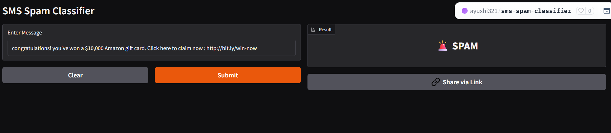
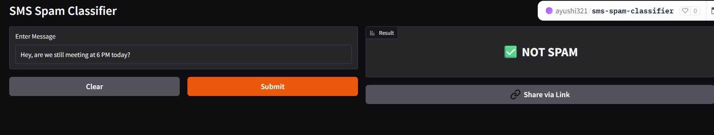

# SMS Spam Classifier

## [Click Here to Try the Live App](https://ayushi321-sms-spam-classifier.hf.space)

An NLP-based machine learning project that classifies SMS messages as spam or not spam with **97% Accuracy** and **100% Precision**

I built this project to understand the workflow deeply rather than just reproduce the output. The process included data cleaning, text preprocessing, feature extraction with TF-IDF, model training, model comparison, and turning the final model into a gradio based web application

  
   
  <em>Model correctly classifying a Spam message</em>

  
   
  <em>Model correctly classifying a Ham message</em>

## What this project does

- preprocesses raw SMS text
- transforms text into numerical features using TF-IDF
- predicts whether a message is spam or not spam
- provides a simple interactive web interface 

## Technical Stack
* **Language:** Python
* **NLP Library:** NLTK (Tokenization, Stemming, Stop-word removal)
* **Machine Learning:** Scikit-learn (Multinomial Naive Bayes, TF-IDF Vectorization)
* **Model Deployment:** Pickle (Serialization)
* **Web Interface:** Gradio
* **Hosting:** Hugging Face Spaces

## The Technical Workflow
To achieve 97% accuracy and 100% precision, I developed a rigorous data science pipeline:

* **Data Cleaning & EDA**: Handled duplicates and explored word distributions to distinguish between Spam and Ham.
* **Text Preprocessing (NLP)**: Created a custom cleaning function for Tokenization, Normalization, Stop-word Removal, and Porter Stemming.
* **Feature Extraction**: Implemented TF-IDF (Term Frequency-Inverse Document Frequency) to convert processed text into numerical vectors based on word importance.
* **Model Training & Comparison**: Evaluated multiple algorithms, ultimately selecting Multinomial Naive Bayes for its superior performance on text-frequency data.
* **Model Serialization**: Used Pickle to export the trained model and vectorizer for production use.
* **Deployment**: Built an interactive web interface using Gradio and successfully deployed it on Hugging Face Spaces.

## Metrics
- **Accuracy:** 97.2%
- **Precision:** 100% (Zero False Positives)

## Project Files

- `app.py` — gradio based web application
- `model.pkl` — trained machine learning model
- `vectorizer.pkl` — fitted TF-IDF vectorizer
- `spam.csv` — dataset used for training
- `requirements.txt`- list of python dependencies
- `SMS Spam Classifier.ipynb` — notebook used for experimentation, analysis, and training

## What I learned

This project strengthened my understanding of:

- text preprocessing for NLP tasks
- TF-IDF vectorization
- training and evaluating multiple classification models
- saving and loading trained ML components with pickle
- debugging environment, path, and deployment-related issues
- converting a notebook-based workflow into a usable app

One of the biggest takeaways from this project was learning that building is not just about writing code — it is also about debugging environments, handling file structure properly, and knowing when to rebuild cleanly instead of forcing a broken setup.
